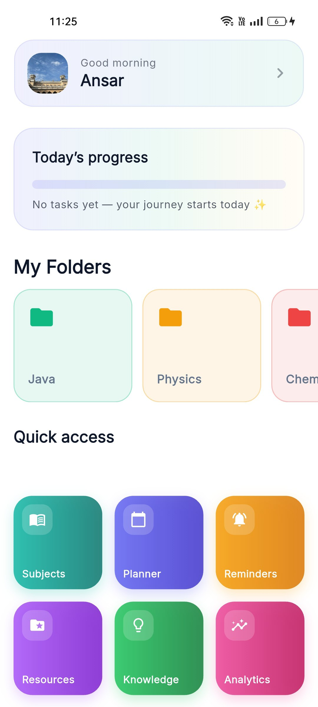
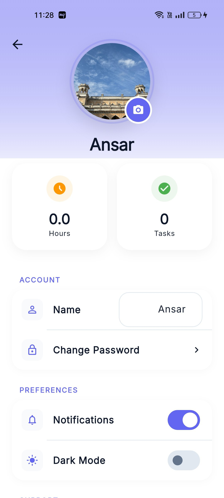
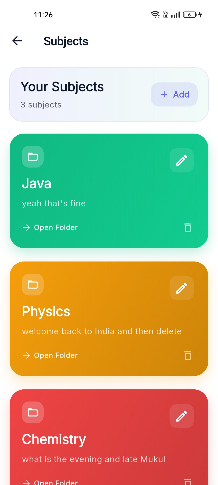
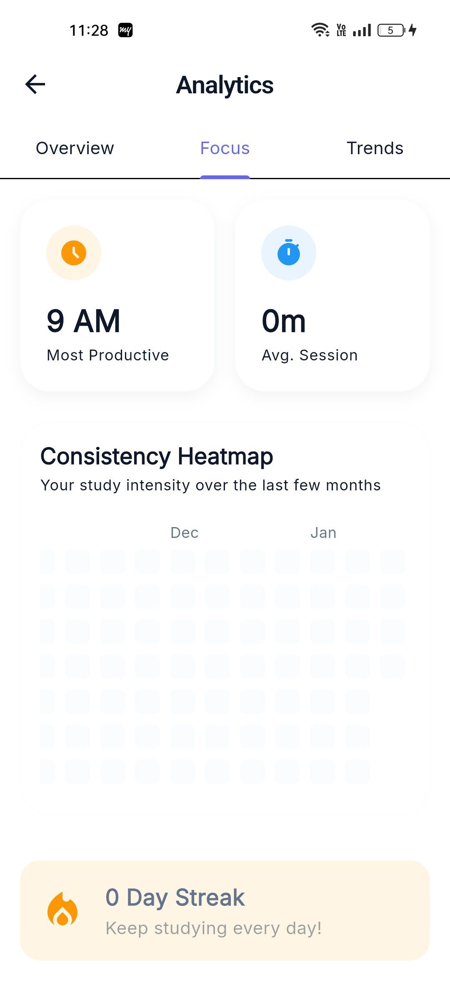
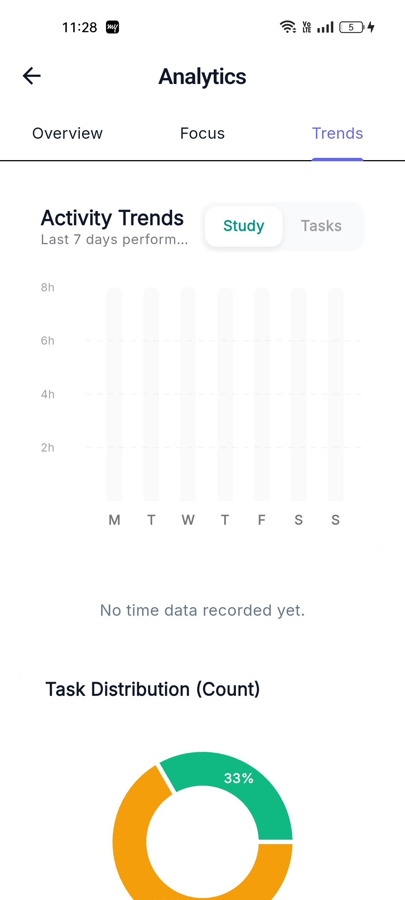
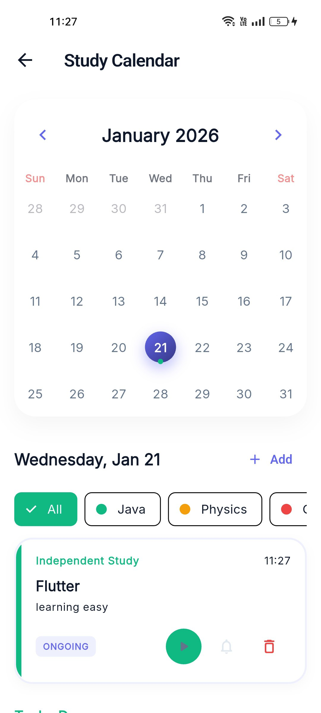
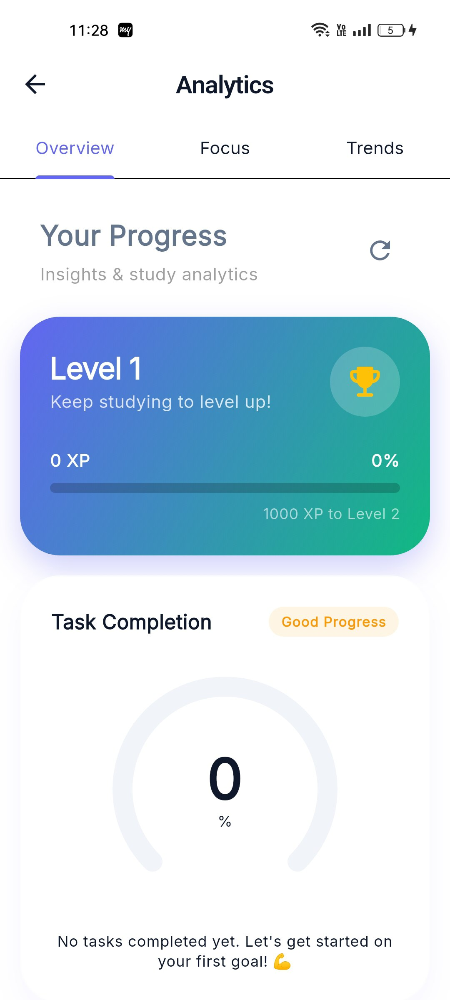
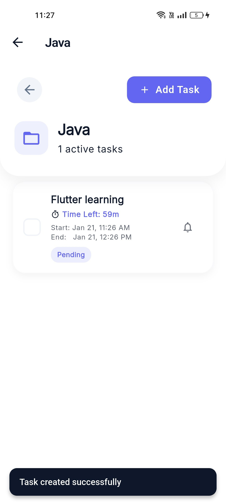
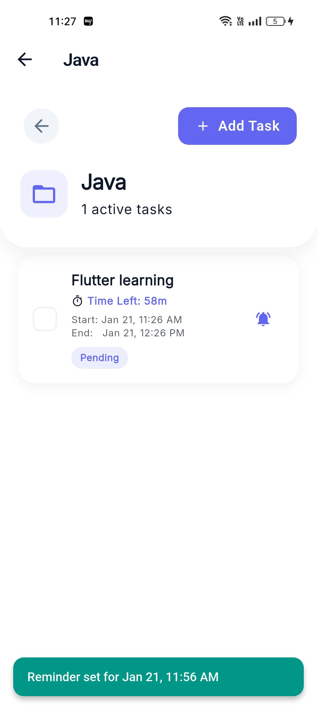
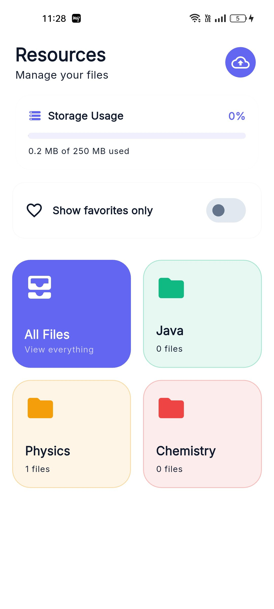

# 🎓 Eduflow


**Eduflow** is a premium education productivity application built with Flutter. It streamlines study planning, task management, and academic performance tracking into a single, cohesive experience. Designed with Clean Architecture and powered by Firebase, it offers a robust, scalable, and visually stunning platform for modern students.

## 📋 Table of Contents
- [✨ Key Features](#-key-features)
- [📱 Screenshots](#-screenshots-gallery)
- [🏗️ Technical Architecture](#-technical-architecture)
- [📂 Folder Structure](#-folder-structure)
- [🚀 Getting Started](#-getting-started)
- [🤝 Contributing](#-contributing)
- [🛡️ Security](#-security)

---

## 🛡️ Security

- **Safe Configuration**: Sensitive infrastructure details are managed via secure configuration files.
- **Identity Protection**: Industry-standard authentication powered by Firebase Auth.
- **Scoped Data**: User data is isolated and secured using granular Cloud Firestore security rules.

---

## 📱 Screenshots Gallery

Explore the intuitive interface of Eduflow:

| **Home Dashboard** | **Profile & Stats** | **Subjects** |
|:---:|:---:|:---:|
|  |  |  |

| **Analytics** | **Performance Trends** | **Focus Session** |
|:---:|:---:|:---:|
|  |  |  |

| **Gamification** | **Task Management** | **Notifications** |
|:---:|:---:|:---:|
|  |  |  |

| **Resource Library** | **Study Reminders** |
|:---:|:---:|
|  |  |

---

## ✨ Key Features

### 🔐 1. Secure Authentication
*   **Complete Flow**: Email/Password login with secure sign-up and password recovery.
*   **Onboarding**: Interactive splash and onboarding screens for new users.

### 📚 2. Subject & Curriculum Control
*   **Visual Organization**: Color-coded subjects for immediate recognition.
*   **Progress Insights**: Real-time task completion tracking per subject.

### ✅ 3. Dynamic Task Management
*   **Full Lifecycle**: Create, update, and manage study tasks with ease.
*   **Prioritization**: Categorize work by High, Medium, or Low urgency.
*   **Notifications**: Smart alerts for upcoming deadlines.

### ⏱️ 4. Immersive Focus Timer
*   **Pomodoro Method**: Dedicated focus blocks to maximize productivity.
*   **Auto-Logging**: Seamlessly records study time against specific subjects.

### 📊 5. Advanced Analytics
*   **Heatmaps**: GitHub-style activity tracking for study consistency.
*   **Interactive Charts**: Deep dives into your time distribution via FL Charts.
*   **Gamification Engine**: Earn XP, level up, and unlock achievements as you study.

### 📂 6. Integrated Resource Library
*   **Document Vault**: Securely store PDFs and reference materials in the cloud.
*   **Smart Linking**: Resources are automatically contextualized with their respective subjects.

### 🔔 7. Precision Reminders
*   **Custom Alarms**: Dedicated study session alarms with a full-screen ringing interface.
*   **Sync**: Persistent reminders to keep your study schedule on track.

---

## 🏗️ Technical Architecture

Eduflow is engineered using **Clean Architecture** to ensure long-term maintainability and performance.

### Architecture Layers
1.  **Presentation**: UI components built with BLoC state management for reactive updates.
2.  **Domain**: Pure business logic and entity definitions, independent of external frameworks.
3.  **Data**: Repository implementations handling Firebase interactions and local caching.

### 🛠️ Core Tech Stack
*   **Framework**: Flutter SDK (3.24+)
*   **State Management**: `flutter_bloc`, `equatable`
*   **Dependency Injection**: `get_it`, `injectable`
*   **Navigation**: `go_router`
*   **Backend**: Firebase (Auth, Firestore, Storage)
*   **Local Storage**: Hive, Shared Preferences
*   **Visualization**: `fl_chart`, `flutter_heatmap_calendar`

---

## 📂 Folder Structure

```
lib/
├── config/              # App configuration (Routes, Theme)
├── core/                # Shared utilities and base classes
├── di/                  # Dependency Injection setup
├── features/            # Modular feature blocks
│   ├── auth/            # Security & Session management
│   ├── dashboard/       # Main navigation hub
│   ├── tasks/           # Workflows & Deadlines
│   ├── subjects/        # Academic organization
│   ├── analytics/       # Data visualization
│   └── ...
└── main.dart            # Entry point
```

---

## 🚀 Getting Started

### Prerequisites
- Flutter SDK installed
- Firebase CLI configured

### Installation

1.  **Clone & Navigate**
    ```bash
    git clone https://github.com/fathimafidha9793/eduflow-app-flutter.git
    cd eduflow-app-flutter
    ```

2.  **Install Dependencies**
    ```bash
    flutter pub get
    ```

3.  **Authentication Setup**
    - Place `google-services.json` in `android/app/`.
    - Place `GoogleService-Info.plist` in `ios/Runner/`.

4.  **Launch**
    ```bash
    flutter run
    ```

---

## 🤝 Contributing

We welcome contributions to Eduflow! Feel free to fork the repository, create a feature branch, and submit a pull request.

## 📄 License

Distributed under the MIT License.

---
**Crafted with excellence for students everywhere.**
#   e d u f l o w - a p p - f l u t t e r