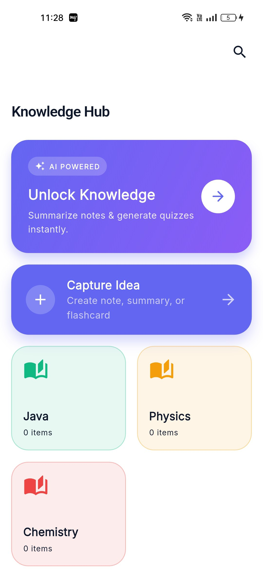

# 🎓 Eduflow


**Eduflow** is a next-generation education productivity application built with Flutter. It combines traditional study planning with modern AI capabilities to help students maximize their learning potential. Designed with Clean Architecture and powered by Firebase, it offers a robust, scalable, and beautiful experience.

## 📋 Table of Contents
- [✨ Key Features](#-key-features)
- [📱 Screenshots](#-screenshots)
- [🏗️ Architecture](#-technical-architecture)
- [📂 Folder Structure](#-folder-structure)
- [🚀 Getting Started](#-getting-started)
- [🤝 Contributing](#-contributing)
- [🛡️ Security](#-security)

---

## 🛡️ Security

This project takes security seriously.
- **API Keys**: All sensitive API keys (e.g., Gemini AI) are stored in secure, git-ignored configuration files.
- **Authentication**: Powered by Firebase Auth for industry-standard security.
- **Data Privacy**: All user data is stored securely in Firestore with user-scoped access rules.

---

## 📱 Screenshots Gallery

Explore the application interface:

| **Home & Dashboard** | **Profile & Settings** | **Subjects Management** |
|:---:|:---:|:---:|
|  |  |  |

| **Analytics Overview** | **Performance Trends** | **Study Focus** |
|:---:|:---:|:---:|
|  |  |  |

| **Knowledge Hub (AI)** | **Gamification** | **Task Management** |
|:---:|:---:|:---:|
|  |  |  |

| **Task Notifications** | **Resource Library** | **Reminders** |
|:---:|:---:|:---:|
|  |  |  |

---

## ✨ Comprehensive Feature List

### 🔐 1. Advanced Authentication & User Management
*   **Sign Up & Login**: Robust email/password authentication via Firebase Auth.
*   **Forgot Password**: Automated email recovery flow.
*   **Splash & Onboarding**: Engaging introductory experience for first-time users.

### 📚 2. Subject & Curriculum Management
*   **Color-Coded Subjects**: visuals distinct subjects for easy recognition.
*   **Progress Tracking**: Monitor task completion rates per subject.
*   **Goal Setting**: Define study goals for each course.

### ✅ 3. Task & To-Do System
*   **CRUD Operations**: Create, Read, Update, and Delete study tasks.
*   **Priority Levels**: Low, Medium, High priority categorization.
*   **Status Workflow**: Move tasks from "To Do" -> "In Progress" -> "Done".
*   **Deadlines**: Set due dates and receive timely notifications.

### ⏱️ 4. Focus Timer & Study Planner
*   **Session Timer**: Dedicated timer for focused study blocks (Pomodoro style).
*   **Session Logging**: Automatically records study duration and associates it with subjects.
*   **Visual Feedback**: Beautiful circular progress indicators during sessions.

### 🤖 5. Knowledge Hub (AI-Powered)
*   **AI Companion**: Built-in chat interface powered by **Gemini AI**.
*   **Smart Assistance**: Ask questions, get summaries, and generate study tips.
*   **Contextual Help**: AI understands the context of your subjects and tasks.

### 📊 6. Analytics & Insights
*   **Consistency Heatmap**: GitHub-style activity graph to visualize daily study streaks.
*   **FL Charts**: Interactive bar and pie charts showing time distribution.
*   **Performance Gauges**: Real-time metrics on task completion efficiency.
*   **Gamification**: Earn XP, level up, and unlock achievements based on study habits.

### 📂 7. Resource Library
*   **File Management**: Upload and store PDF notes, images, and reference materials.
*   **Categorization**: Resources automatically linked to specific subjects.
*   **Cloud Storage**: Securely stored using Firebase Storage.

### 🔔 8. Reminders & Alarms
*   **Custom Alarms**: Set dedicated alarms for study sessions.
*   **Push Notifications**: Reminders for upcoming task deadlines.
*   **Alarm Ringing Screen**: Full-screen wake-up interface for study alarms.

### ⚙️ 9. Admin Panel & Settings
*   **User Management**: Admin tools to view user statistics (for app administrators).
*   **Dark Mode**: First-class support for system-wide dark/light themes.
*   **Feedback System**: Direct channel to send app feedback.

---

## 🏗️ Technical Architecture

This project follows **Clean Architecture** principles to ensure scalability, testability, and maintainability.

### Layers
1.  **Presentation Layer**:
    *   **Pages & Widgets**: UI components built with Flutter.
    *   **State Management**: **BLoC (Business Logic Component)** pattern for separating logic from UI.
2.  **Domain Layer**:
    *   **Entities**: Pure Dart classes representing business objects.
    *   **Use Cases**: Encapsulate specific business rules (e.g., `LoginUser`, `GetTasks`).
    *   **Repositories (Interfaces)**: Abstract contracts for data operations.
3.  **Data Layer**:
    *   **Repositories (Implementations)**: Concrete logic to fetch data.
    *   **Data Sources**: Direct connections to Firebase, Local Storage, or APIs.
    *   **Models**: Data Transfer Objects (DTOs) with JSON serialization.

### 🛠️ Tech Stack & Dependencies

*   **Core**: [Flutter](https://flutter.dev/) (SDK 3.24+), Dart.
*   **State Management**: `flutter_bloc`, `equatable`.
*   **Dependency Injection**: `get_it`, `injectable`.
*   **Routing**: `go_router` for declarative navigation.
*   **Backend (BaaS)**:
    *   `firebase_auth` (Authentication)
    *   `cloud_firestore` (NoSQL Database)
    *   `firebase_storage` (File Storage)
*   **Local Storage**: `shared_preferences`, `flutter_secure_storage`.
*   **UI  & Animations**: `flutter_animate`, `flutter_screenutil`, `google_fonts`, `fl_chart`.
*   **Utilities**: `intl` (Formatting), `uuid` (Unique IDs), `logger` (Debugging).
*   **AI**: `google_generative_ai` (Gemini API).

---

## 📂 Folder Structure

```
lib/
├── config/              # App configuration (Routes, Theme)
├── core/                # Shared utilities, Constants, Base classes
│   ├── errors/          # Failure handling
│   ├── usecase/         # Base usecase params
│   └── utils/           # Logger, validators
├── di/                  # Dependency Injection setup
├── features/            # Feature-based modules
│   ├── auth/            # Authentication (Login, Register)
│   ├── dashboard/       # Home screen logic
│   ├── tasks/           # Task management
│   ├── subjects/        # Subject management
│   ├── analytics/       # Stats and Charts
│   ├── knowledge/       # AI Hub
│   └── ...
└── main.dart            # Application Entry Point
```

---

## 🚀 Getting Started

### Prerequisites
*   Flutter SDK installed.
*   Dart SDK installed.
*   Firebase Project set up.

### Installation

1.  **Clone the Repository**
    ```bash
    git clone https://github.com/ansar7787/smart-study-plan.git
    cd smart-study-plan
    ```

2.  **Install Dependencies**
    ```bash
    flutter pub get
    ```

3.  **Configure Firebase**
    *   Add `google-services.json` to `android/app/`.
    *   Add `GoogleService-Info.plist` to `ios/Runner/`.

4.  **Run the App**
    ```bash
    flutter run
    ```

---

## 🤝 Contributing

Contributions are welcome!
1.  Fork the Project.
2.  Create your Feature Branch (`git checkout -b feature/AmazingFeature`).
3.  Commit your Changes (`git commit -m 'Add some AmazingFeature'`).
4.  Push to the Branch (`git push origin feature/AmazingFeature`).
5.  Open a Pull Request.

## 📄 License

Distributed under the MIT License. See `LICENSE` for more information.

---

**Developed with ❤️ by Ansar**
# eduflow-app-flutter

# eduflow-app-flutter

# eduflow-app-flutter

# eduflow-app-flutter

